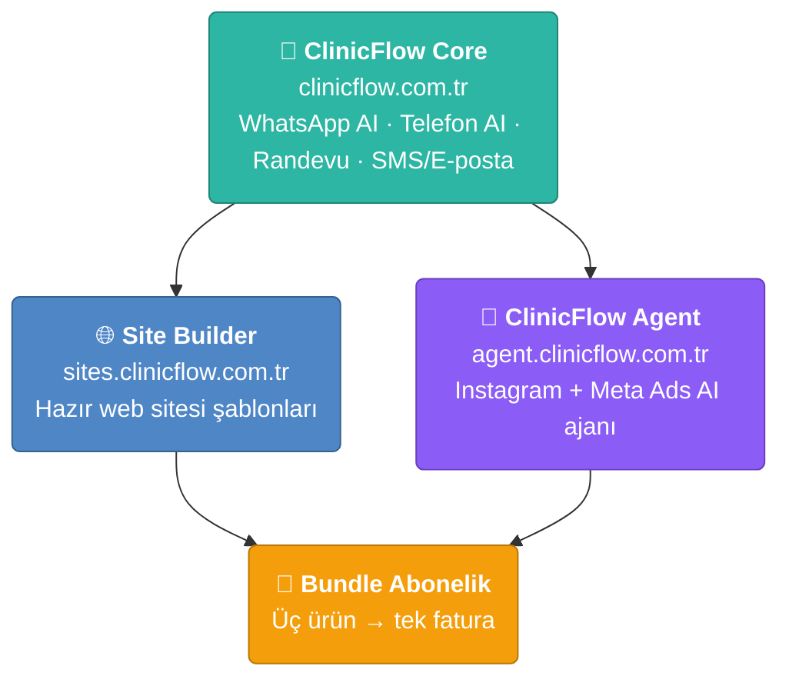

# 🏥 ClinicFlow

**Özel klinikler için yapay zeka destekli işletim sistemi**

 

---

## 👋 Merhaba

Ben **Kadir Aydın** — Endüstri Mühendisi ve yazılım geliştirici. Kurumsal BT/altyapı tarafında çalışırken, kendi girişimim **ClinicFlow**'u geliştiriyorum: psikolog, diyetisyen, estetisyen ve diğer özel klinikler için randevudan iletişime, web sitesinden sosyal medyaya kadar tüm operasyonu otomatikleştiren bir SaaS ailesi.

ClinicFlow üç tamamlayıcı üründen oluşur. Hepsi tek bir altyapı üzerinde, multi-tenant mimariyle çalışır.

---

## 🧩 Ürün Ailesi

### 🏥 ClinicFlow — Core &nbsp;  &nbsp; `clinicflow.com.tr`

> Kliniğinizin yapay zeka destekli iletişim ve randevu merkezi. Hastalarınızla 7/24 konuşur, randevu defterinizi otonom yönetir, hatırlatmaları kendisi gönderir.

| | |
|---|---|
| 💬 **WhatsApp AI** | Hasta sorularını yanıtlar, randevu oluşturur, takip eder |
| 📞 **Telefon AI** | Sesli yapay zeka ile çağrı karşılama ve yönlendirme |
| 📅 **Akıllı Randevu** | Otonom randevu defteri, çakışma kontrolü, takvim senkronizasyonu |
| 📨 **SMS / E-posta Otomasyonu** | Otomatik hatırlatma, onay ve geri kazanım akışları |

 

### 🌐 ClinicFlow Site Builder &nbsp; `sites.clinicflow.com.tr`

> Kliniğinize dakikalar içinde profesyonel bir web sitesi. Hazır şablonlar, kod bilgisi gerektirmez.

| | |
|---|---|
| 🎨 **Hazır Şablonlar** | Klinik branşına özel, mobil uyumlu tasarımlar |
| ⚡ **Dakikalar İçinde Yayında** | Kur, içeriğini gir, yayına al |
| 🔧 **Teknik Bilgi Gerekmez** | Sürükle-bırak kolaylığı, bakım derdi yok |

 

### 🤖 ClinicFlow Agent &nbsp;  &nbsp; `agent.clinicflow.com.tr`

> Kliniğinizin yapay zeka sosyal medya ve reklam yöneticisi. Instagram içeriğinizi otonom üretir, Meta reklamlarınızı yönetir, performansınızı izler.

| | |
|---|---|
| 📸 **Otomatik Post Üretimi** | Carousel ve görsel içerikleri uçtan uca otonom üretir |
| ✍️ **İçerik Kişiselleştirme** | Marka tonu ve branşa göre uyarlanmış metin + tasarım |
| 📣 **Reklam Yönetimi** | Meta Ads kampanyalarını kurar ve optimize eder |
| 📊 **Meta Ads Paneli** | Tüm reklam hesabı tek ekranda |
| 📈 **Performans İzleme** | Erişim, etkileşim ve dönüşüm metrikleri |
| 🔗 **Meta Entegrasyonu** | Instagram & Facebook hesaplarıyla doğrudan bağlantı |
| 🏢 **Tenant İzolasyonu** | Her klinik için izole, güvenli veri alanı |
| 💳 **Abonelik Yönetimi** | Otonom faturalama ve plan yönetimi |

---

## 🗺️ Ekosistem

Üç ürün, tek altyapı. Tek tek de kullanılır, bundle olarak da.

### 💎 Bundle Abonelik
**Üç ürünü tek pakette, tek faturayla.** &nbsp;Klinik operasyonunun tamamı — iletişim, web ve sosyal medya — tek yerden.

---

## 🛠️ Teknoloji

**Mimari:** Multi-tenant (schema-per-tenant) · EF Core · RabbitMQ tabanlı asenkron iş kuyruğu · Coolify üzerinde CI/CD (GitHub Actions) · Cloudflare DNS · wildcard subdomain routing.

---

## 📊 GitHub

---

## 🤝 İletişim

 

💚 Kliniğinizi yapay zekayla büyütün — <a href="https://clinicflow.com.tr">clinicflow.com.tr</a>

